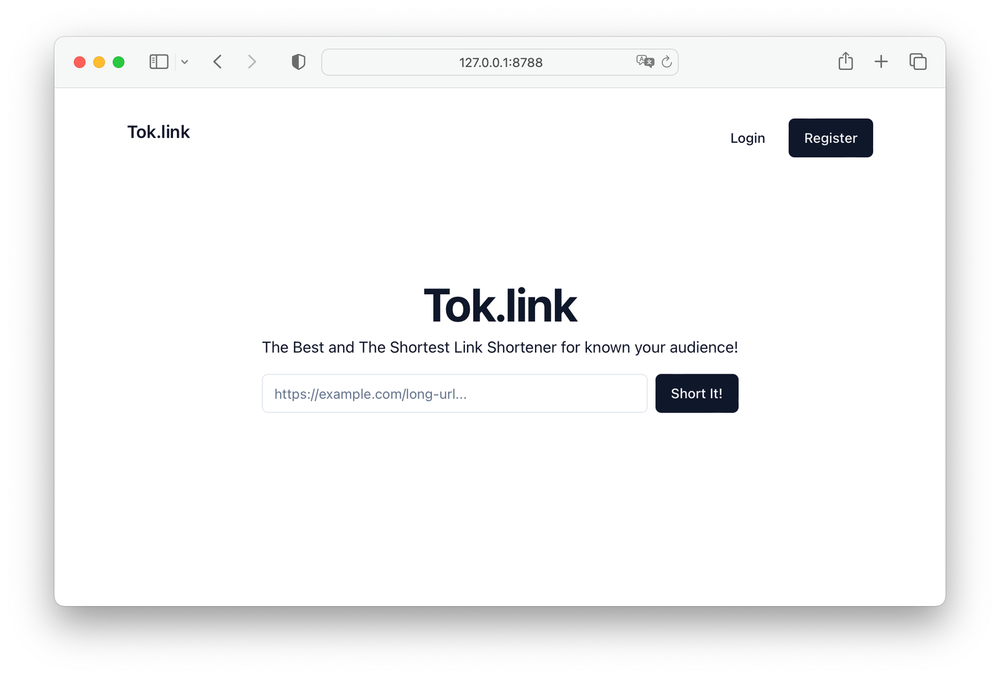

# Tok.link

Example project of Superflare + Remix.

```bash
npm run dev
```



## How to deploy?

1. Add APP_KEY env

```bash
npx wrangler secret put APP_KEY -j
```

2. Run migration

```bash
npx wrangler  d1 migrations apply DB -j
```

3. Publish site

```bash
npx wrangler publish -j
```
